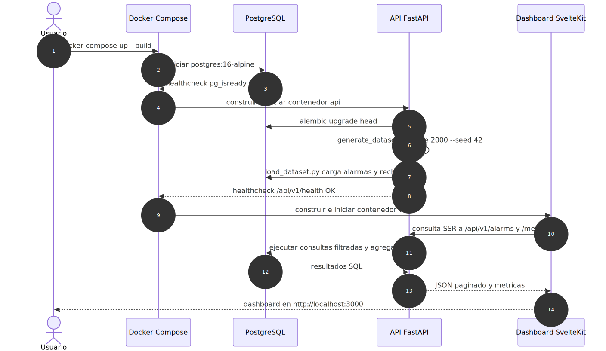
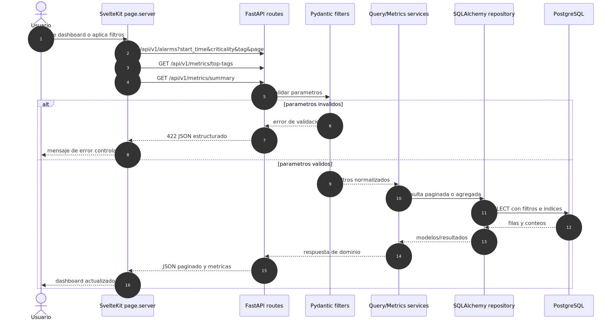

# SCADA Alarm Gateway and Migrator

Solucion monorepo para procesar alarmas industriales SCADA desde archivos legacy CSV/JSON, normalizarlas, guardarlas en PostgreSQL y consultarlas desde una API FastAPI y un dashboard SvelteKit.

El caso original pide una solucion funcional para migrar datos historicos con inconsistencias tipicas de SCADA: nulos, fechas heterogeneas, tipos irregulares y duplicados. Este proyecto cubre ese flujo completo con dataset sintetico, ETL, modelo relacional, API, pruebas, Docker y frontend.

## Vista Rapida

| Pieza | Tecnologia | Responsabilidad |
| --- | --- | --- |
| `api/` | FastAPI, SQLAlchemy, Alembic, Pandas | API, ETL, modelos, migraciones y pruebas backend. |
| `web/` | SvelteKit, TypeScript, Tailwind | Dashboard con filtros, metricas, top tags y listado paginado. |
| `db` | PostgreSQL 16 | Persistencia relacional de alarmas, batches y rechazos. |
| `docker-compose.yml` | Docker Compose | Levanta base de datos, API y frontend con un comando. |

## Arquitectura de Componentes



Fuente editable: [`docs/diagrams/architecture-components.mmd`](docs/diagrams/architecture-components.mmd)

## Flujo ETL



Fuente editable: [`docs/diagrams/etl-flow.mmd`](docs/diagrams/etl-flow.mmd)

El pipeline:

| Etapa | Que hace |
| --- | --- |
| Generacion | Crea dataset sintetico CSV/JSON con registros validos, errores y duplicados. |
| Lectura | Detecta CSV o JSON y carga el contenido. |
| Parseo | Convierte fechas, strings y prioridad. |
| Normalizacion | Homologa criticidad, estados, tags y textos. |
| Validacion | Rechaza filas sin `tag`, sin `event_time`, con criticidad invalida o tiempos inconsistentes. |
| Deduplicacion | Rechaza duplicados por clave de negocio dentro del lote. |
| Carga bulk | Inserta registros validos en PostgreSQL por chunks. |
| Trazabilidad | Guarda rechazos y resumen del batch de ingesta. |

## Operacion del Proceso



Fuente editable: [`docs/diagrams/operation-sequence.mmd`](docs/diagrams/operation-sequence.mmd)

Al ejecutar Docker Compose, la API espera a PostgreSQL, aplica migraciones Alembic, genera el dataset, lo carga y luego expone endpoints REST. El frontend espera a que la API este saludable y consulta datos server-side desde SvelteKit.

## Modelo de Datos



Fuente editable: [`docs/diagrams/data-model.mmd`](docs/diagrams/data-model.mmd)

Tablas principales:

| Tabla | Proposito |
| --- | --- |
| `alarms` | Alarmas normalizadas y consultables. |
| `ingestion_batches` | Trazabilidad de cada archivo procesado. |
| `alarm_rejections` | Filas rechazadas con payload original y motivo. |

Indices y restricciones importantes:

| Elemento | Proposito |
| --- | --- |
| `uq_alarm_business_key` | Evita duplicados por `external_alarm_id`, `event_time`, `tag`. |
| `ix_alarms_event_time` | Optimiza filtros por tiempo. |
| `ix_alarms_criticality` | Optimiza filtros por criticidad. |
| `ix_alarms_tag` | Optimiza filtros por tag. |
| Indices compuestos | Cubren filtros combinados por tag/criticidad y fecha. |

## Flujo de Consulta API



Fuente editable: [`docs/diagrams/api-request-flow.mmd`](docs/diagrams/api-request-flow.mmd)

El dashboard llama a la API para listar alarmas y calcular metricas. FastAPI valida parametros con Pydantic, ejecuta consultas SQLAlchemy y responde JSON estructurado. Si hay errores de validacion, retorna `422` sin exponer stack traces.

## Ejecucion con Docker

Requisito: Docker Desktop o Docker Engine.

```powershell
cd D:\Proyectos\Soap\Test
docker compose up --build
```

Servicios expuestos:

| Servicio | URL / Puerto |
| --- | --- |
| Frontend | `http://localhost:3000` |
| API | `http://localhost:8000` |
| Swagger | `http://localhost:8000/docs` |
| Health | `http://localhost:8000/api/v1/health` |
| PostgreSQL | `localhost:5432` |

El contenedor `api` ejecuta automaticamente:

```sh
alembic upgrade head
python scripts/generate_dataset.py --size ${DATASET_SIZE:-2000} --seed 42
python scripts/load_dataset.py --file data/raw/alarms_dataset.csv
uvicorn app.main:app --host 0.0.0.0 --port 8000
```

Para una demo limpia, borrar el volumen antes de levantar:

```powershell
docker compose down -v
docker compose up --build
```

## Ejecucion Local

### Backend

```powershell
cd D:\Proyectos\Soap\Test\api
python -m venv .venv
.\.venv\Scripts\activate
python -m pip install -r requirements.txt
alembic upgrade head
python scripts/generate_dataset.py --size 2000 --seed 42
python scripts/load_dataset.py --file data/raw/alarms_dataset.csv
uvicorn app.main:app --reload
```

### Frontend

```powershell
cd D:\Proyectos\Soap\Test\web
npm install
npm run dev
```

## API

Base URL local:

```text
http://localhost:8000
```

Endpoints principales:

| Metodo | Ruta | Uso |
| --- | --- | --- |
| `GET` | `/api/v1/health` | Estado de API y conexion DB. |
| `GET` | `/api/v1/alarms` | Lista alarmas con filtros y paginacion. |
| `GET` | `/api/v1/alarms/{id}` | Consulta una alarma por id. |
| `GET` | `/api/v1/metrics/top-tags` | Tags con mayor cantidad de eventos. |
| `GET` | `/api/v1/metrics/summary` | Totales y distribuciones para dashboard. |

Ejemplos:

```powershell
curl.exe http://localhost:8000/api/v1/health
curl.exe "http://localhost:8000/api/v1/alarms?page=1&page_size=20"
curl.exe "http://localhost:8000/api/v1/alarms?criticality=HIGH&tag=TAG_A"
curl.exe "http://localhost:8000/api/v1/metrics/top-tags?limit=10"
curl.exe http://localhost:8000/api/v1/metrics/summary
```

Filtros soportados en `/api/v1/alarms`:

| Parametro | Descripcion |
| --- | --- |
| `start_time` | Fecha/hora inicial inclusive. |
| `end_time` | Fecha/hora final inclusive. |
| `criticality` | `HIGH`, `MEDIUM` o `LOW`. |
| `tag` | Coincidencia parcial por tag. |
| `page` | Numero de pagina desde 1. |
| `page_size` | Tamano de pagina, maximo 100. |

## Frontend

El dashboard en `http://localhost:3000` permite:

| Funcion | Descripcion |
| --- | --- |
| Filtros | Fecha inicial/final, criticidad, tag y tamano de pagina. |
| Metric cards | Total de alarmas, distribucion por criticidad, estado y ultimo evento. |
| Top tags | Ranking de tags mas frecuentes. |
| Listado | Tabla paginada con alarma, activo, criticidad, estado y tiempos. |
| Enlace Swagger | Acceso directo a la documentacion interactiva de la API. |

## Variables de Entorno

| Variable | Valor ejemplo | Uso |
| --- | --- | --- |
| `DATABASE_URL` | `postgresql+psycopg://scada:scada_pass@db:5432/scada_db` | Conexion SQLAlchemy/PostgreSQL. |
| `API_HOST` | `0.0.0.0` | Host de Uvicorn. |
| `API_PORT` | `8000` | Puerto de la API. |
| `DEBUG` | `false` | Debug/log SQL. |
| `PUBLIC_API_BASE_URL` | `http://localhost:8000` | Base URL para frontend local. |
| `CORS_ORIGINS` | `["http://localhost:3000"]` | Origenes permitidos. |
| `BATCH_SIZE` | `500` | Tamano de chunks para carga bulk. |
| `DATASET_SEED` | `42` | Seed del dataset sintetico. |
| `DATASET_SIZE` | `2000` | Registros validos base. |

## Pruebas

Backend:

```powershell
cd D:\Proyectos\Soap\Test\api
.\.venv\Scripts\python.exe -m pytest
```

Resultado backend validado: 68 pruebas pasando, 86 warnings conocidos, 3.13s.

Frontend:

```powershell
cd D:\Proyectos\Soap\Test\web
npm run check
npm test
npm run build
```

Validacion HTTP:

```powershell
curl.exe -s -o NUL -w "%{http_code}" http://localhost:8000/docs
curl.exe -s http://localhost:8000/api/v1/health
curl.exe -s -o NUL -w "%{http_code}" http://localhost:3000
```

## Documentacion Complementaria

| Documento | Uso |
| --- | --- |
| [`docs/informe-ejecutivo.md`](docs/informe-ejecutivo.md) | Informe de sustentacion y cumplimiento del caso. |
| [`api/docs/technical-design.md`](api/docs/technical-design.md) | Notas tecnicas del backend y reglas ETL. |
| [`docs/diagrams/`](docs/diagrams/) | Fuentes Mermaid y SVG de arquitectura y flujos. |

## Limitaciones

| Tema | Estado |
| --- | --- |
| Autenticacion | Fuera de alcance de la demo; documentado como mejora antes de produccion. |
| Coleccion Postman | El PDF recomienda probar endpoints con Postman; se validaron escenarios equivalentes con `curl`, pero no se entrega coleccion formal. |
| Timestamps | Hay warnings por `datetime.utcnow()`; no afecta la demo, pero conviene migrar a timestamps timezone-aware. |
| Volumen Docker | Si no se ejecuta `docker compose down -v`, los datos pueden acumularse entre demos. |

## Troubleshooting

| Problema | Solucion |
| --- | --- |
| `No module named pytest` | Activar `.venv` e instalar `api/requirements.txt`. |
| Puertos ocupados | Ejecutar `docker compose ps` y detener procesos o `docker compose down`. |
| Datos duplicados en demo | Ejecutar `docker compose down -v` antes de levantar. |
| Frontend no conecta API | Revisar `PUBLIC_API_BASE_URL` y `CORS_ORIGINS`. |
